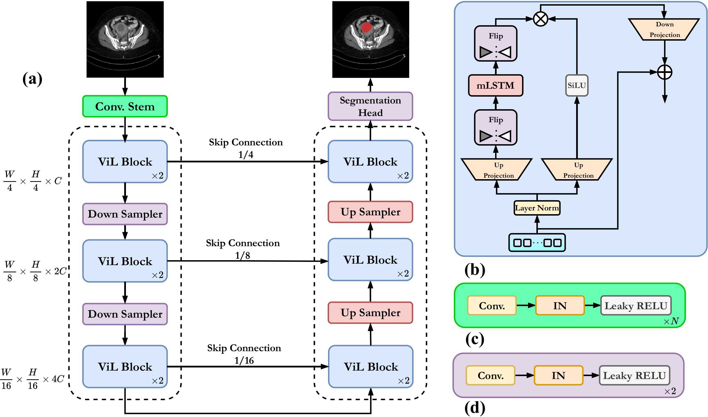

🚀 **Official Repository for SPIE 2025 Accepted Paper (ViLU-Net)** 🚀  

**📄 Paper:** *A Study on the Performance of U-Net Modifications in Retroperitoneal Tumor Segmentation* 

📌 **Status:** Accepted at **SPIE Medical Imaging 2025** 🎉  

🔗 **[Read the Paper on arXiv](https://arxiv.org/abs/2502.00314)**

ViLU-Net is our SPIE 2025 architecture built on nnU-Net v2, embedding Vision-LSTM (ViL) blocks in both encoder and decoder. Two variants are provided: 2D and 3D full-resolution.

## Data Availability
Due to privacy reasons, the retroperitoneal dataset used in our experiments cannot be shared. The code is fully usable on any dataset organized in nnU-Net format. Example public datasets and instructions are listed in `data/README.md`.

## Architecture at a Glance


## Quick Start
1) Create environment (example): `conda create -n vilunet python=3.10 -y && conda activate vilunet`
2) Install PyTorch matching your CUDA: `pip install torch==2.0.1 torchvision==0.15.2 --index-url https://download.pytorch.org/whl/cu118`
3) Install this repo in editable mode:
   ```bash
   cd ViLU-Net
   pip install -e .
   ```
4) Preprocess data with nnU-Net v2:
   ```bash
   nnUNetv2_plan_and_preprocess -d DATASET_ID --verify_dataset_integrity
   ```

## Training
Use the unified trainer `nnUNetTrainerViLUNet` for both 2D and 3D.
```bash
# 2D
nnUNetv2_train DATASET_ID 2d all -tr nnUNetTrainerViLUNet -lr 5e-3 -bs 2

# 3D full-res
nnUNetv2_train DATASET_ID 3d_fullres all -tr nnUNetTrainerViLUNet -lr 5e-3 -bs 1
```
Adjust `-bs` and `-lr` to your hardware and dataset.

## Inference
```bash
nnUNetv2_predict -i INPUT_FOLDER -o OUTPUT_FOLDER -d DATASET_ID -c {2d|3d_fullres} -f all -tr nnUNetTrainerViLUNet --disable_tta
```

## 🏆 Acknowledgment  
We sincerely thank the authors of **[U-Mamba](https://github.com/bowang-lab/U-Mamba)**, and **[xLSTM-Unet](https://github.com/tianrun-chen/xLSTM-UNet-Pytorch)** for their open-source contributions.  

---

## 📖 Citation  
If you find our work useful, please consider citing our paper:  

```bibtex
@inproceedings{10.1117/12.3046948,
author = {Moein Heidari and Ehsan Khodapanah Aghdam and Alexander Manzella and Daniel Hsu and Rebecca Scalabrino and Wenjin Chen and David J. Foran and Ilker Hacihaliloglu},
title = {{A study on the performance of U-Net modifications in retroperitoneal tumor segmentation}},
volume = {13407},
booktitle = {Medical Imaging 2025: Computer-Aided Diagnosis},
editor = {Susan M. Astley and Axel Wism{\"u}ller},
organization = {International Society for Optics and Photonics},
publisher = {SPIE},
pages = {134071N},
keywords = {Retroperitoneal tumor, Deep learning, Convolutional neural network, U-Net, Mamba, Transformer, xLSTM},
year = {2025},
doi = {10.1117/12.3046948},
URL = {https://doi.org/10.1117/12.3046948}
}
